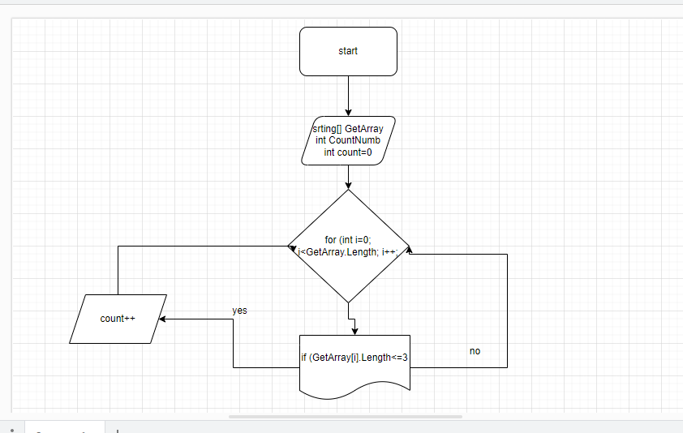

# Итоговая работа

## Блок схема :

## Описание алгоритма :

Сначала ввела string массив, ввела переменную count. Затем метод, в котором цикл соразмерный длине массива, внутри цикла проверка условия ( <=3 ), если да элемент первого массива заносится в count. Переменная count чтобы посчитать сколько массивов с искомой длинной. После присвоения увеличивается переменная count на 1 и возвращается к циклу for в котором i увеличивается на 1. И так проверяется до конца.

